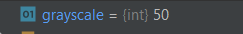

# PyCharmLesson

## Время выполнения файлов

*Время выполнения ```filter.py```:*

*Время выполнения ```old_filter.py```:*


Разница во времени вызвана тем, что в новом варианте фильтра большая часть времени выполнения затрачивается на ввод
данных пользователем.

*Время выполнения ```filter_with_filename.py```:*


Сильное уменьшение времени работы файла вызвано тем, что данные не вводятся пользователем. Так же быстродействию
способствует использование библиотеки numpy, вместо ручных циклов, при работе с матрицами.

## Исходное изображение и результаты

*Исходное изображение:*

*Результат работы ```filter_with_filename.py```:*

*Результат работы ```old_filter.py```:*


## Doc-тесты

*doc-тест для ```img_to_nparr()```:*


*часть doc-теста для ```create_pixel_art()```:*


## Отладчик

*Ширина и высота изображения:*
- 
- 

*Тип изображения:*
- 

*Значение ширины блока и количество градаций серого:*
- 
- 